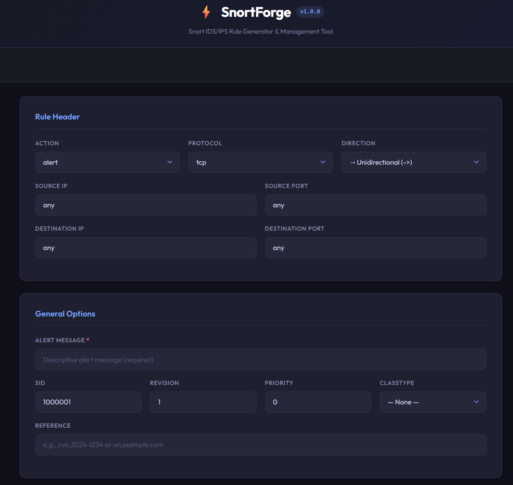
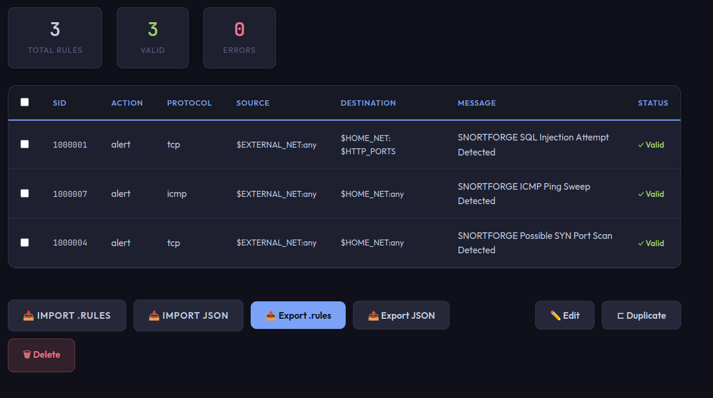
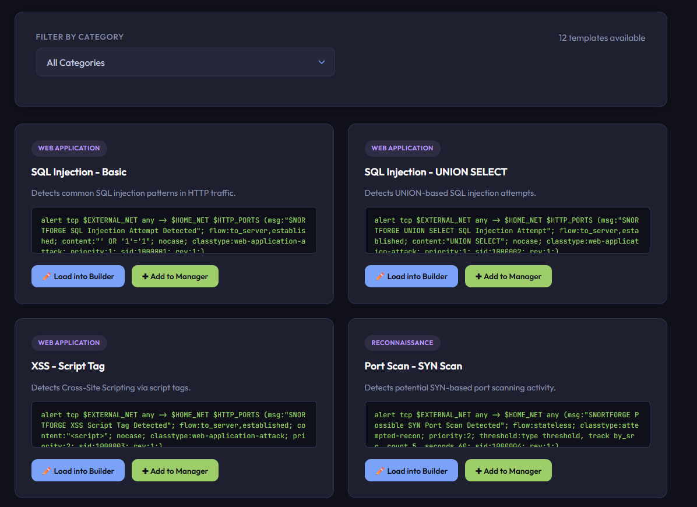

# SnortForge

**Snort IDS/IPS Rule Generator & Management Tool**

A web-based application for building, validating, managing, and exporting Snort intrusion detection rules with a clean, dark-themed interface.

---

##  Overview

SnortForge streamlines the creation and management of Snort IDS/IPS rules. Whether you're writing custom detection rules for a SOC, building a ruleset for a home lab, or studying for security certifications — SnortForge provides a structured, error-checked workflow.

### Key Capabilities

- **Visual Rule Builder** — Form-based rule creation with real-time live preview
- **Syntax Validation** — Server-side validation catches errors and suggests best practices
- **12 Detection Templates** — Pre-built rules for SQL injection, XSS, brute force, port scans, reverse shells, and more
- **Rule Manager** — Bulk operations: edit, duplicate, delete, import, export
- **Import/Export** — Read `.rules` files and export for direct Snort deployment
- **Dark Theme** — Clean, spacious interface built for extended use

---


## 📸 Screenshots

### Rule Builder
*Build Snort rules visually with a live-updating preview*



### Rule Manager
*Manage, import, export, and validate your entire ruleset*



### Templates
*Start from 12 pre-built detection templates across 5 categories*



---

##  Installation

### Prerequisites

- **Python 3.8+**
- **pip** (Python package manager)

### Setup

```bash
# 1. Clone the repository
git clone https://github.com/Rootless-Ghost/SnortForge.git
cd SnortForge

# 2. Create a virtual environment (recommended)
python -m venv venv

# Windows
venv\Scripts\activate

# Linux / macOS
source venv/bin/activate

# 3. Install dependencies
pip install -r requirements.txt

# 4. Launch SnortForge
python app.py
```

Then open your browser to **http://127.0.0.1:5000**

---

##  Usage

### Rule Builder

1. Fill in the **Rule Header** (action, protocol, IPs, ports, direction)
2. Add a descriptive **message** and set the **SID** (>= 1,000,000 for custom rules)
3. Configure **detection options** (content matching, PCRE, depth/offset)
4. Set **flow options** for stateful detection
5. Optionally add **threshold** settings for rate-based alerting
6. Watch the **live preview** update as you type
7. Click **Validate** to check for errors
8. Click **Add to Manager** to store the rule

### Rule Manager

- View all rules with validation status at a glance
- **Import** existing `.rules` files or SnortForge JSON projects
- **Export** your ruleset as `.rules` files ready for deployment
- **Edit**, **duplicate**, or **delete** rules
- Click any row to preview the full rule text

### Templates

- Browse **12 pre-built detection templates** organized by category:
  - **Web Application** — SQLi, XSS, directory traversal
  - **Reconnaissance** — Port scan, ping sweep, DNS zone transfer
  - **Brute Force** — SSH, FTP
  - **Malware / C2** — Reverse shell, DNS tunneling
  - **Exploit** — EternalBlue
- Load directly into the Builder for customization or add straight to the Manager

---

##  Project Structure

```
SnortForge/
├── app.py                          # Flask application entry point
├── snortforge/
│   ├── __init__.py
│   ├── core/
│   │   ├── rule.py                 # Snort rule data model & builder
│   │   ├── validator.py            # Rule validation engine
│   │   ├── templates_data.py       # Pre-built detection templates
│   │   └── parser.py               # .rules file parser
│   ├── static/
│   │   ├── css/style.css           # Dark theme stylesheet
│   │   └── js/app.js               # Frontend application logic
│   └── templates/
│       └── index.html              # Main application page
├── screenshots/
├── requirements.txt
├── .gitignore
├── LICENSE
└── README.md
```

---

##  Technical Details

| Component | Technology |
|-----------|-----------|
| Language | Python 3.8+ |
| Backend | Flask |
| Frontend | HTML5, CSS3, Vanilla JavaScript |
| Architecture | Flask API + Client-side SPA |
| Rule Engine | Custom parser + builder |
| Validation | Regex-based syntax checking + best practice analysis |
| Export Formats | `.rules` (Snort-native), `.json` (SnortForge project) |

---

##  Roadmap

- [ ] Multi-content rule support (chained content matches)
- [ ] Snort 3 syntax output mode
- [ ] Rule performance scoring
- [ ] Dark/light theme toggle
- [ ] Persistent storage (database backend)
- [ ] Community template sharing

---


## 📜 License

This project is licensed under the MIT License — see the [LICENSE](LICENSE) file for details.

---

## 👤 Author

**Rootless-Ghost**
