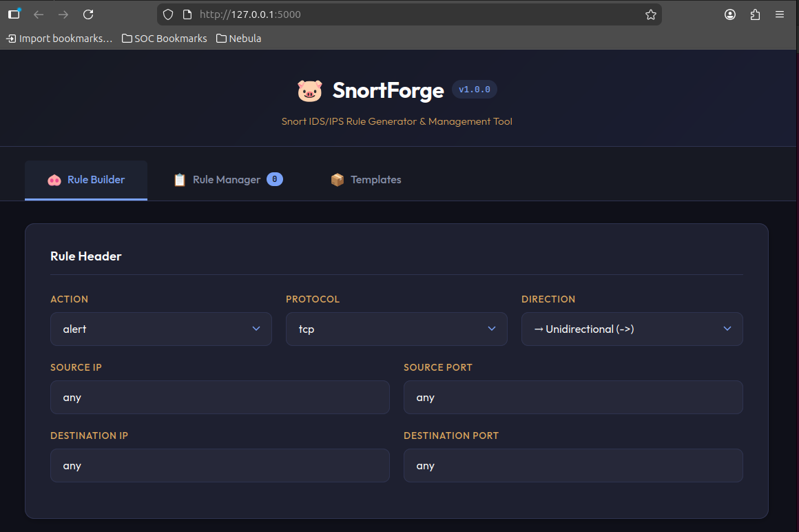
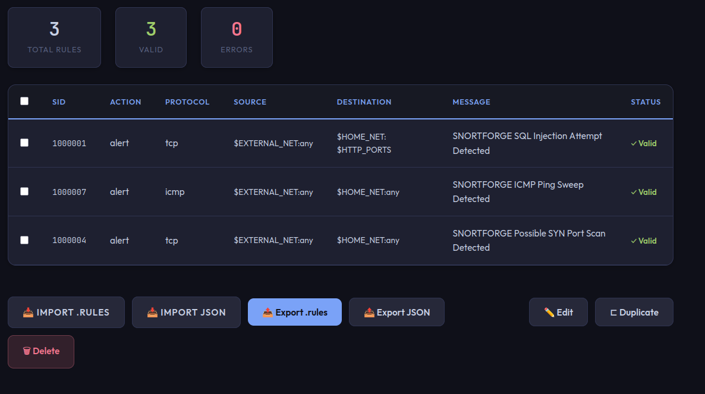
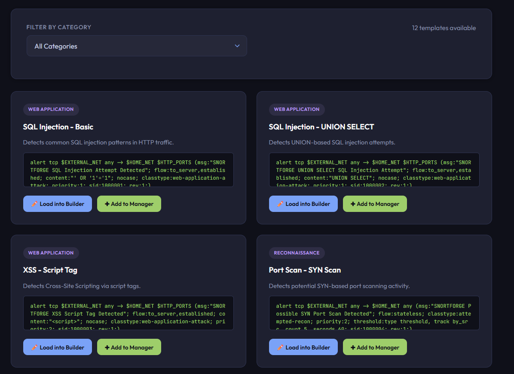

<div align="center">
  
# 🐷 SnortForge

</div>

<p align="center">
  <strong>Snort IDS/IPS Rule Generator & Management Tool</strong>
</p>

<p align="center">
  
  
  
  
  
</p>

<p align="center">
  A web-based application for building, validating, managing, and exporting Snort intrusion detection rules with a clean, dark-themed interface.
</p>

---

##  Overview

SnortForge streamlines the creation and management of Snort IDS/IPS rules. Whether you're writing custom detection rules for a SOC environment, building a ruleset for a home lab, or studying for security certifications — SnortForge provides a structured, error-checked workflow for rule development.

### Key Capabilities

- **Visual Rule Builder** — Form-based rule creation with real-time live preview
- **Multi-Content Chaining** — Chain multiple content matches with independent modifiers (depth, offset, distance, within) for precise, multi-stage detection
- **Snort 2 / Snort 3 Toggle** — Switch between Snort 2 and Snort 3 syntax output with a single toggle — sticky buffers, `detection_filter`, and space-separated modifiers handled automatically
- **Rule Performance Scoring** — 8-criteria analysis engine scores rules 0–100 with letter grades and actionable optimization tips for detection engineering best practices
- **Inline Help Tooltips** — Hover `?` icons explain detection options, flow settings, and threshold behavior
- **Syntax Validation** — Server-side validation catches errors and suggests best practices before deployment
- **12 Detection Templates** — Pre-built rules for SQL injection, XSS, brute force, port scans, reverse shells, and more
- **Rule Manager** — Bulk operations: edit, duplicate, delete, import, export
- **Import/Export** — Read `.rules` files and export for direct Snort 2 or Snort 3 deployment
- **PCRE Flag Checkboxes** — Set regex flags visually instead of typing `/pattern/flags` manually
- **HTTP URI / Header Matching** — Restrict content matches to the request URI or HTTP headers for web attack detection
- **Multiple References** — Add CVE, Bugtraq, URL, and other reference types with structured input and validation
- **Dark Theme** — Clean, spacious interface built for extended use


---

##  Screenshots

### Rule Builder
*Build Snort rules visually with a live-updating preview*



### Performance Score
*Score your rules against detection engineering best practices*


### Rule Manager
*Manage, import, export, and validate your entire ruleset*



### Templates
*Start from 12 pre-built detection templates across 5 categories*



---

##  Installation

### Prerequisites

- **Python 3.8+**
- **pip** (Python package manager)

### Setup

```bash
# 1. Clone the repository
git clone https://github.com/Rootless-Ghost/SnortForge.git
cd SnortForge

# 2. Create a virtual environment (recommended)
python -m venv venv

# Windows
venv\Scripts\activate

# Linux / macOS
source venv/bin/activate

# 3. Install dependencies
pip install -r requirements.txt

# 4. Launch SnortForge
python3 app.py
```

Then open your browser to **http://127.0.0.1:5000**

---

##  Usage

### Rule Builder

1. Fill in the **Rule Header** (action, protocol, IPs, ports, direction)
2. Add a descriptive **message** and set the **SID** (>= 1,000,000 for custom rules)
3. Configure **detection options** (content matching, PCRE, depth/offset)
4. Set **flow options** for stateful detection
5. Optionally add **threshold** settings for rate-based alerting
6. Watch the **live preview** update as you type
7. Click **Validate** to check for errors
8. Click **Add to Manager** to store the rule
9. Add **references** (CVE, URL, Bugtraq, etc.) using the type dropdown and value field

> **Tip:** Hover the `?` icons next to any detection option for a quick explanation of what it does and when to use it.

### Rule Manager

- View all rules with validation status at a glance
- **Import** existing `.rules` files or SnortForge JSON projects
- **Export** your ruleset as `.rules` files ready for Snort deployment
- **Edit**, **duplicate**, or **delete** rules
- Click any row to preview the full rule text

### Templates

Browse **12 pre-built detection templates** organized by category:

| Category | Templates |
|----------|-----------|
| **Web Application** | SQL Injection (Basic & UNION), XSS Script Tag, Directory Traversal |
| **Reconnaissance** | SYN Port Scan, ICMP Ping Sweep, DNS Zone Transfer |
| **Brute Force** | SSH Brute Force, FTP Brute Force |
| **Malware / C2** | Netcat Reverse Shell, DNS Tunneling |
| **Exploit** | SMB EternalBlue Probe |


## Detection Options Reference

SnortForge's Rule Builder includes several content matching modifiers that control **how** and **where** Snort inspects packet payloads. Understanding these options is essential for writing precise, performant detection rules.

### Content Match Modifiers

| Option | Snort Syntax | Description |
|--------|-------------|-------------|
| **Case Insensitive** | `nocase` | Match content regardless of uppercase/lowercase. `content:"GET"; nocase;` matches `GET`, `get`, `Get`, etc. |
| **Negated Match** | `content:!"...";` | Alert when the specified content is **not found** in the packet. Useful for detecting the *absence* of expected data. |
| **HTTP URI** | `http_uri` | Only match content within the HTTP request URI (path and query string). Narrows scope for better performance and fewer false positives. |

#### Negated Match — When to Use It

Negated matching inverts the detection logic: instead of firing when content is present, the rule fires when it's missing. This is valuable in scenarios like:

- **Missing HTTP headers** — Flag responses that lack a `Content-Type` header, which may indicate a misconfigured or malicious server
- **Protocol violations** — Detect traffic on a known port that doesn't contain expected protocol banners (e.g., port 80 traffic without `HTTP/`)
- **Data exfiltration indicators** — Alert on DNS responses missing standard response codes that may signal DNS tunneling

**Example:** Alert on HTTP traffic that does not contain a standard status code:
```
alert tcp $HTTP_SERVERS $HTTP_PORTS -> any any (msg:"HTTP response missing status code"; flow:established,from_server; content:!"HTTP/1."; depth:7; sid:1000001; rev:1;)
```

> **Note:** Negated content matches are most effective when combined with `flow` and other positional modifiers to avoid excessive false positives.

### Positional Modifiers

These modifiers restrict **where** within the payload Snort searches for content, improving both accuracy and performance.

| Option | Snort Syntax | Description |
|--------|-------------|-------------|
| **Depth** | `depth:<bytes>;` | Only search within the first N bytes from the start of the payload (or from the last content match). Limits the search window. |
| **Offset** | `offset:<bytes>;` | Skip the first N bytes before starting the search. Useful for ignoring known headers or fields. |
| **Distance** | `distance:<bytes>;` | After the previous content match, skip N bytes before searching for the next content. Used in chained content matches. |
| **Within** | `within:<bytes>;` | After the previous content match, search only within the next N bytes. Pairs with `distance` for tight matching. |

#### How Positional Modifiers Work Together

```
Packet payload (byte positions):
0         10        20        30        40
|─────────|─────────|─────────|─────────|
GET /login.php HTTP/1.1\r\nHost: example.com

content:"GET"; depth:3;
  └─ Only checks bytes 0–2 (first 3 bytes)

content:"/login"; offset:3;
  └─ Starts searching at byte 3, skips "GET"

content:"GET"; depth:3; content:".php"; distance:1; within:15;
  └─ After matching "GET", skips 1 byte, then searches within the next 15 bytes for ".php"
```

#### Why Use Positional Modifiers?

- **Performance** — Narrowing the search window means Snort examines fewer bytes per packet, reducing CPU load on high-traffic networks
- **Precision** — Prevents false positives by ensuring content only matches in the expected location (e.g., matching `admin` in the URI path, not in the page body)
- **Chained detection** — `distance` and `within` let you match multiple content strings in a specific order and proximity, which is critical for detecting multi-stage attack patterns

### PCRE Flags
 
| Flag | Modifier | Description |
|------|----------|-------------|
| **nocase** | `/i` | Case-insensitive matching |
| **dotall** | `/s` | Dot (`.`) matches any character including newlines |
| **multiline** | `/m` | `^` and `$` match start/end of each line, not just the string |
| **extended** | `/x` | Unescaped whitespace ignored, `#` starts comments |

### Putting It All Together — Example Rule

Detect a potential SQL injection attempt in an HTTP POST body:

```
alert tcp any any -> $HTTP_SERVERS $HTTP_PORTS (msg:"Possible SQL injection in POST body"; flow:established,to_server; content:"POST"; depth:4; content:"UNION"; distance:0; nocase; content:"SELECT"; distance:0; within:20; nocase; sid:1000002; rev:1;)
```

**Breakdown:**
- `content:"POST"; depth:4;` — Confirm it's a POST request by checking the first 4 bytes
- `content:"UNION"; distance:0; nocase;` — Look for "UNION" anywhere after "POST," case insensitive
- `content:"SELECT"; distance:0; within:20; nocase;` — Look for "SELECT" within 20 bytes after "UNION"

This chained approach reduces false positives compared to matching `UNION SELECT` as a single string, since attackers often insert whitespace, comments, or encoding between keywords.

---

## Multi-Content Chaining

SnortForge v1.2.0 supports chaining multiple content matches within a single rule — the way most real-world detection rules are written. Click **"+ Add Content Match"** to add additional content blocks, each with independent modifiers.

### How It Works

Each content block gets its own set of controls:

| Control | Description |
|---------|-------------|
| **Content** | The string or hex pattern to match |
| **nocase** | Case-insensitive matching for this content |
| **Negated (!)** | Alert when this content is NOT found |
| **HTTP URI / Header** | Restrict match to URI or headers |
| **Depth / Offset** | Absolute position within the payload |
| **Distance / Within** | Relative position to the previous content match |

The first content block (blue accent) is the primary fast-pattern match. Subsequent blocks (purple accent) are chained matches that Snort evaluates in sequence after the first match hits.

### Example: SQL Injection in POST Body

| Block | Content | Modifiers |
|-------|---------|-----------|
| Content #1 | `POST` | depth:4 |
| Content #2 | `UNION` | nocase, distance:0 |
| Content #3 | `SELECT` | nocase, distance:0, within:20 |

**Snort 2 output:**
```
alert tcp any any -> $HTTP_SERVERS $HTTP_PORTS (msg:"SQL Injection in POST"; flow:established,to_server; content:"POST"; depth:4; content:"UNION"; nocase; content:"SELECT"; nocase; within:20; sid:1000002; rev:1;)
```

**Snort 3 output:**
```
alert tcp any any -> $HTTP_SERVERS $HTTP_PORTS (msg:"SQL Injection in POST"; flow:established,to_server; content:"POST"; depth 4; content:"UNION"; nocase; content:"SELECT"; nocase; within 20; sid:1000002; rev:1;)
```

---

## Snort 3 Syntax Mode

Toggle between Snort 2 and Snort 3 output using the switch in the **Live Preview** header. The toggle affects the live preview, clipboard copy, and `.rules` file export.

### Key Syntax Differences

| Feature | Snort 2 | Snort 3 |
|---------|---------|---------|
| HTTP URI buffer | `http_uri` (modifier after content) | `http.uri` (sticky buffer before content) |
| HTTP Header buffer | `http_header` (modifier after content) | `http.header` (sticky buffer before content) |
| Positional modifiers | `depth:4` (colon-separated) | `depth 4` (space-separated) |
| Rate limiting | `threshold:type limit, ...` | `detection_filter:track by_src, ...` |

---

## Rule Performance Scoring

Click **"📊 Score Performance"** to analyze your rule against 8 detection engineering criteria. The scorer returns a 0–100 score, letter grade (A–F), per-criteria breakdown, and actionable optimization tips.

### Scoring Criteria

| Criteria | Weight | What It Measures |
|----------|--------|-----------------|
| **Content Match** | 25 pts | Presence, length, chaining, and HTTP scoping |
| **Positional Modifiers** | 15 pts | Use of depth, offset, distance, within |
| **Flow State** | 15 pts | Established/stateless, direction keywords |
| **Network Scope** | 15 pts | IP/port narrowing, variable usage |
| **PCRE Efficiency** | 10 pts | Anchored vs standalone, greedy patterns |
| **Threshold Config** | 5 pts | Rate-limiting configuration |
| **Metadata Quality** | 10 pts | Message length, classtype, references, SID range |
| **General Hygiene** | 5 pts | Direction, revision |

Multi-content rules receive bonus points for chaining — up to +6 for three or more chained content matches with positional modifiers.

---

## Project Structure

```
SnortForge/
├── app.py                          # Flask application & API routes
├── snortforge/
│   ├── __init__.py
│   ├── core/
│   │   ├── rule.py                 # Snort rule data model & builder (Snort 2 + 3)
│   │   ├── validator.py            # Rule validation engine
│   │   ├── scorer.py               # Rule performance scoring engine
│   │   ├── templates_data.py       # 12 pre-built detection templates
│   │   └── parser.py               # .rules file parser & importer
│   ├── static/
│   │   ├── css/style.css           # Dark theme stylesheet
│   │   └── js/app.js               # Frontend application logic
│   └── templates/
│       └── index.html              # Main application page
├── screenshots/
├── requirements.txt
├── .gitignore
├── LICENSE
└── README.md
```

---

## Technical Details

| Component | Technology |
|-----------|-----------|
| **Language** | Python 3.8+ |
| **Backend** | Flask 3.0+ |
| **Frontend** | HTML5, CSS3, Vanilla JavaScript |
| **Architecture** | Flask REST API + Client-side SPA |
| **Rule Engine** | Custom parser + builder with dataclass models |
| **Validation** | Regex-based syntax checking + best practice analysis |
| **Export Formats** | `.rules` (Snort-native), `.json` (SnortForge project) |

### How It Works

```
┌─────────────┐     ┌──────────────┐     ┌───────────────┐
│  Browser UI  │────▶│  Flask API   │────▶│  Rule Engine  │
│  (HTML/JS)   │◀────│  (Python)    │◀────│  (Core)       │
└─────────────┘     └──────────────┘     └───────────────┘
                          │
                    ┌─────┼──────┐
                    │     │      │
               ┌────▼──┐ ▼   ┌──▼─────┐
               │Validate│ │   │ Export  │
               │ Engine │ │   │ .rules │
               └────────┘ │   └────────┘
                     ┌────▼────┐
                     │  Score  │
                     │ Engine  │
                     └─────────┘
```

---

## Roadmap
 
- [x] Multiple reference support (CVE, Bugtraq, URL, OSVDB, and more)
- [x] Inline help tooltips for detection options
- [x] PCRE flag checkboxes
- [x] HTTP URI content modifier
- [x] Multi-content rule support (chained content matches)
- [x] Snort 3 syntax output mode
- [x] Rule performance scoring
- [ ] Dark/light theme toggle
- [ ] Persistent storage (database backend)
- [ ] Community template sharing

---

## License

This project is licensed under the MIT License — see the [LICENSE](LICENSE) file for details.

---

<div align="center">

Built by [Rootless-Ghost](https://github.com/Rootless-Ghost) 

</div>
